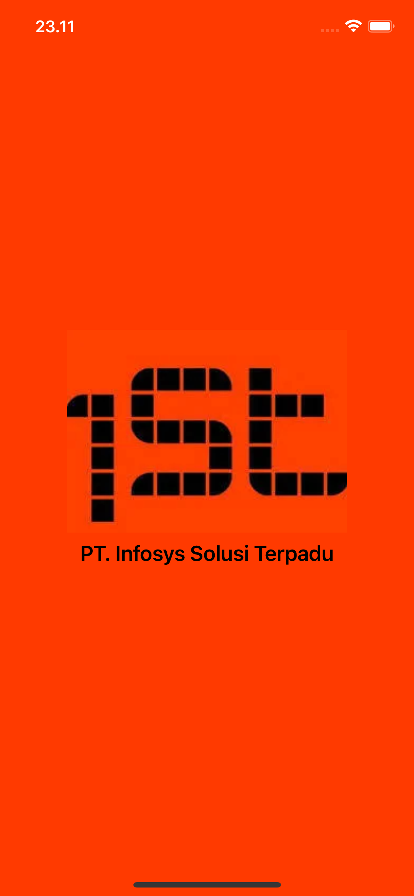
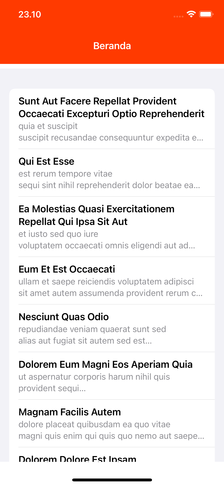
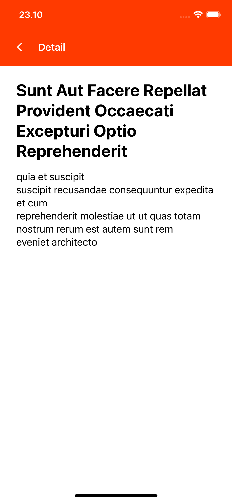

# Infosys_Test Project

## Project Description
This project is a simple iOS app that displays a list of items and details.
This app was created as part of a test for an iOS Developer position at Infosys.

## 🧩 Tech Stack

1. Swift 6+
2. SwiftUI
3. Combine
4. MVVM Architecture

## 📦 Requirements

1. Xcode 16 or latest
2. iOS 18 or latest

## ▶️ How to Run

1. Clone repository:
```
git clone https://github.com/jagoankode/infosys_test.git
```

2. Open project:
```
cd MyiOSApp
open MyiOSApp.xcodeproj
```

3. run in simulator or real device:
```
press Cmd + R in Xcode
```

## 📷 Screenshots
```
screenshots/
    ├── detail_screen.png
    └── home_screen.png
    └── splash_screen.png
```

<p align="center">
  
  
  
</p>

## 👤 Author
```
Name: Brillian Andrie Nugroho Wiguno
Posisition: IOS Developer
```
## 📄 License
This project is licensed under the MIT License.
